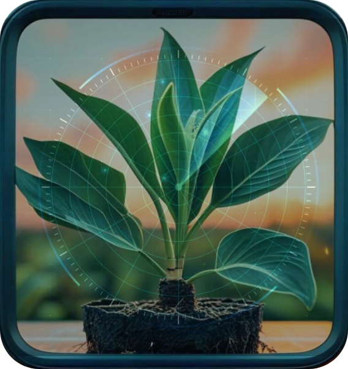
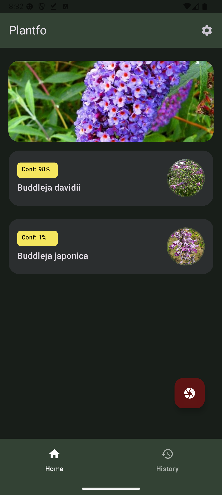
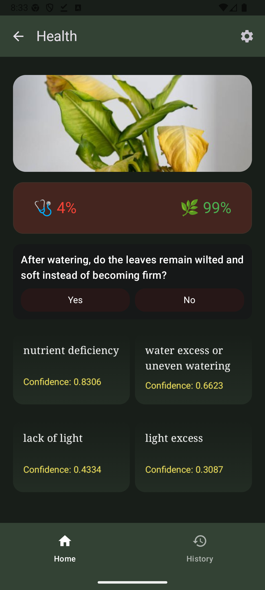
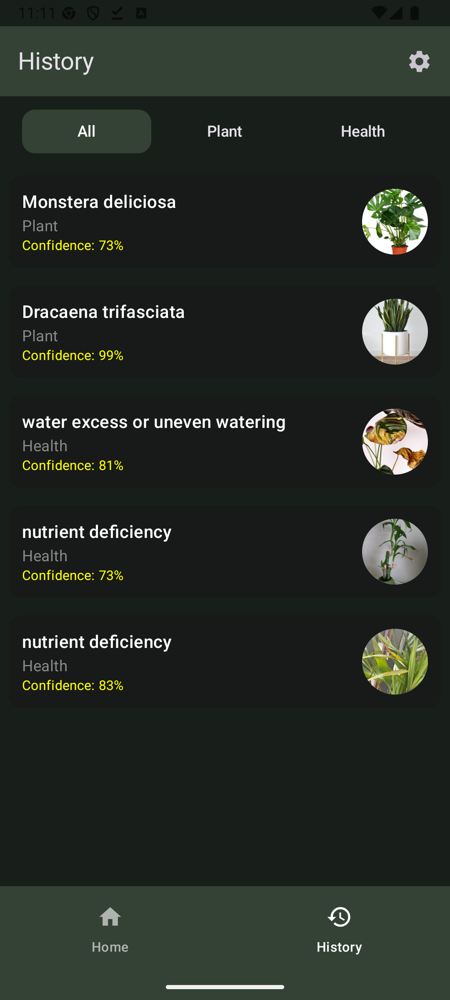

# 🌿 Plant Identifire App (Plantfo)

**PlantCareApp** is a cross-platform application built with Kotlin Multiplatform.  
It allows users to identify plants from images, detect diseases, and get detailed care instructions using the Plant.id API , saving feature in local storage.

---

  

---

##  Screenshots

  
  
  

---

##  Features

-  **Capture & Select Plant Image:** Take photos using the camera or select from the gallery  
-  **Plant Identification:** Identify plants via the Plant.id API  
-  **Disease Detection:** Detect common plant diseases from images  
-  **Plant Care Advice:** Provide watering, lighting, and soil recommendations  
-  **History:** Save results in local storage  
-  **Offline Mode:** Use Fake Repository with local JSON for development/testing  
-  **Multi-platform Support:** Android & iOS with shared Kotlin Multiplatform UI
  
---

##  Architecture & Technology

### Architecture
- **MVVM** (Model–View–ViewModel) for clean separation of concerns  
- **Repository Pattern** for abstracting data sources

### Tech Stack
- **Shared Logic and UI for Android and IOS :** Kotlin Multiplatform (KMP)  
 
### Networking
- **Ktor Client** for REST API communication  
- **FakeRepository** for local mock data during development  

### Data Persistence
- **Room Database (Multiplatform)** – Version 2.7.1 for storing history on both Android and iOS

### Image Upload & Display
- **Coil** (Android) – For loading and displaying plant images  

### Dependency Injection
- **Koin** – Used to manage dependencies

---

##  Development Plan

-  Development & Optimization for iOS 
-  Firestore as an online database for plants & user settings
-  plant identification via name input 
-  Filter by date, plant name, or disease type
-  Firebase login and cloud sync (planned)  
-  Export & Share
-  AI-powered Chatbot assistant  
-  Multilingual UI support  

---

##  Author

**Tarlan Bakhtiari**  
*PlantCareApp – Kotlin Multiplatform Final Project*
